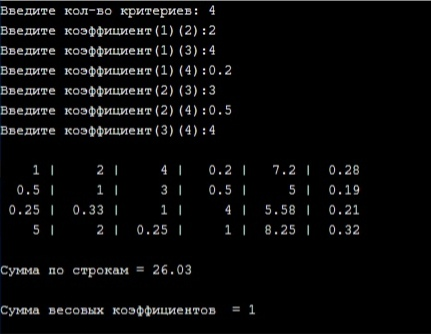

# Hierarchy-analysis-method

### Описание назначения
Программа реализует метод анализа иерархий Т. Саати с помощью построения таблицы попарного сравнения критериев. Рассчитываются весовые коэффициенты

### О работе с программой
Пользователь задает количество критериев и в соответствии со шкалой вводит результаты попарного сравнения.
Программа строит таблицу попарного сравнения, рассчитывается сумма коэффициентов.

### Запуск программы
Программа реализована на языке С++, написана посредством Microsoft Visual Studio 2019. Для открытия используется файл 'HAM.txt'

### Пример работы программы
 - таблица коэффициентов.
